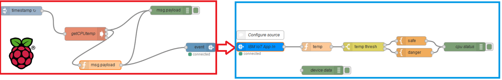

## Overview
Let’s say we are monitoring the temperature of a green house. We want to learn if the temperature exceeds 40 degrees Celsius to alert the manager and / or social networks to support administration of the equipment. 
This lab will show how you can deliver this type of functionality with the popular IoT device Raspberry Pi with its great price/feature parameters.
This lab shows you how to create the connection between the Internet of Things (IoT) device and the IBM Bluemix cloud. You are going to use Raspberry Pi to push information from its temperature sensor (the temperature of the CPU) to the cloud. In addition you are going to publish the information to Twitter about the state of your device.
To create the application in this lab, follow these main steps:

1.	Use the Bluemix to create the Internet of Things platform starter.
2.	Connect to the simulated device.
3.	(optional) connect to the real device.
4.	(optional) Publish information to the Twitter.

Here come the flows showing processing of the information from Raspberry Pi to Bluemix Node.Red.

## Prerequisites 
You need the following software:

-	IBM Bluemix account http://bluemix.net
-	(optional) a Twitter account

## Next steps
Please follow [LAB 2](https://github.com/blumareks/iot-watson-swift/tree/master/lab2) and LAB 3.

@blumareks, http://blumareks.blogpost.com
