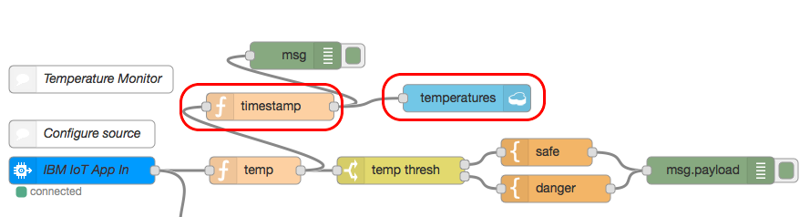

## Overview
Let’s say we are monitoring the temperature of a green house. We want to learn if the temperature exceeds 40 degrees Celsius to alert the manager and / or social networks to support administration of the equipment. 
This lab will show how you can deliver this type of functionality with the popular IoT device Raspberry Pi with its great price/feature parameters.
This lab shows you how to create the connection between the Internet of Things (IoT) device and the IBM Bluemix cloud. You are going to use Raspberry Pi to push information from its temperature sensor (the temperature of the CPU) to the cloud. In addition you are going to publish the information to Twitter about the state of your device.
To create the application in this lab, follow these main steps:

1.	Use the Bluemix to create the Internet of Things platform starter.
2.	Connect to the simulated device.
3.	(optional) connect to the real device.
4.	Publish information to the Twitter.
5.  Reading the temperature on your iOS smart device

Here come the flows showing processing of the information from Raspberry Pi to Bluemix Node.Red.


## Prerequisites 
You need the following software:

-	IBM Bluemix account http://bluemix.net
-	a Twitter account

## Adding the "temperatures" db and Swift iOS app
In addition to Twitter you can easily add a Cloudant database node to insert the temperatures into database, and then you might want to read them from your smart device, when you want to validate what is happening with your physical temperature sensor (and follow up with your social network followers from the previous Step 4).
Let’s first add the Cloudant database called “temperatures” to the existing Node.Red internal Cloudant DB – from the dashboard just select Databases and hit Create Database 

then in the Node.Red flow add Cloudant insert node,  configure it to insert data into the internal Cloudant DB with all the msg parameters

and connect the Cloudant node and function nodes to the previously created Node.Red flow at the output of the temp node as shown:



Let’s configure the timestamp node to add the time to the temperature in the msg.payload to insert it in the Cloudant DB.
```js
msg.timestamp= new Date().toISOString();
return msg;
```
Optionally you might want to change it further for the readability purposes. When you are ready to deploy the changes – please re-Deploy the Node.Red flow.
Let’s see how the temperatures are being recorded. We can open the Cloudant DB Dashboard and investigate the temperature records.

Now we are ready for the next step of building an iOS app with the UI to read the temperature from Cloudant DB.
Let’s create a UI in SWIFT in XCode. [Please refer to the solution youtube video - click here](https://youtu.be/dsNXsHrW5TA) on how to deploy a button (Refresh IoT Temp) and the Label on the UI Main.storyboard from the Object Library.

You can now connect the UI with the code. Please refer to the solution video on how to do it.
Here comes the final result of doing so:
```swift 
import UIKit
//import SwiftCloudant from CocoaPods

class ViewController: UIViewController {

    @IBOutlet weak var tempLabel: UILabel!
    private var jsonTemp = 0.0
    
    override func viewDidLoad() {
        super.viewDidLoad()
        // Do any additional setup after loading the view, typically from a nib.
    }

    override func didReceiveMemoryWarning() {
        super.didReceiveMemoryWarning()
        // Dispose of any resources that can be recreated.
    }

    @IBAction func refreshButtonPressed(_ sender: Any) {
        NSLog("refresh IoT Temp button pressed")
        //get the temp
        //update the label
        tempLabel.text = "T= ?" 
    }
}
```
When it is done before the next step we need to close this project (or entire XCode).

Let’s add the SwiftCloudant CococaPods resource. You should get the CocoaPods with the latest XCode, to get the latest update just type in the terminal: sudo pod update
You need to install the CocoaPods’ SwiftCloudant pod. In order to do it you need to open terminal, go to the project directory selected when creating an iOS app and initialize Podfile by issuing a command ```sudo pod init``` in the root directory of the app. When it is done you can modify Podfile with the vim Podfile command.

after finishing all edits (uncommenting ```platform``` and adding ```pod 'SwiftCloudant'```) you can hit ‘esc’ key, and type vi editor command ```:wq``` that would save the file and close the vim editor. Now you are ready to start the Cocoapods package manager by issuing command ```pod install```.

Now you can open the XCode and instead of launching xcodeproj you need to use xcworkspace as it was described in the output of the Cocoapods project. In this example it is ```CheckIoTTemp.xcworkspace``` file. When you open CheckIoTTemp.xcworkspace from XCode you would see your project with the additional Pods folders.

Let’s use the SwiftCloudant library in the code to access the DB. After opening the workspace, we need to build the code – by pressing cmd-B or by going to the Product menu and selecting Build item – before referring to the SwiftCloudant library.
When your code is built, you would see the SwiftCloudant.framework of the CocoaPods products realized. 

Only then you can start importing the library with import SwiftCloudant:
```swift
import UIKit
//import SwiftCloudant from CocoaPods
import SwiftCloudant

class ViewController: UIViewController {
```
After doing so you can leverage this library to do CRUD operations in the Bluemix based Cloudant. 
Find the connection credential in your Bluemix project.

Here comes the code to connect to Cloudant DB, and read the JSON with the embedded temperature:
```swift
        //connect to Cloudant
        let cloudantUrl = NSURL(string: "cloudant db connection url")
        let cloudantClient = CouchDBClient(url: cloudantUrl! as URL, username: "cloudant db connection user", password: "cloudant db connection password")
        let database = "temperatures"
        
        //find the temp record
        let find = FindDocumentsOperation(selector: [:], databaseName: database, fields: ["payload", "timestamp"], limit: 1, skip: 0, sort:  [Sort(field: "timestamp", sort: Sort.Direction.desc)], bookmark: nil, useIndex: nil, r: 1)
        { (response, httpInfo, error) in
            if let error = error {
                print("Encountered an error while reading a document. Error:\(error)")
            } else {
                print("Read document: \(response)")
	     }
	 }
        cloudantClient.add(operation:find)
        //update the label
```


Let’s parse JSON to get the temperature. Since the response JSON from the find query looks like the following console debug we would need to get to the nested part of the document marked in red:

```
Read document: Optional(["warning": no matching index found, create an index to optimize query time, "docs": <__NSSingleObjectArrayI 0x608000007e90>(
{
    payload = 40;
    timestamp = 20170201070636;
}
)
])
```

We are interested in getting the payload value of the temperature. To parse JSON we use these commands – see the do – catch clause used for the JSONSerialization exception catching:
```swift
//get the temp value from JSON
                do {
                    let data = try JSONSerialization.data(withJSONObject: response!, options: [])
                    
                    let parsedJson = try JSONSerialization.jsonObject(with: data, options: []) as! [String:Any]
                    if let nestedArray = parsedJson["docs"] as? NSArray {

                        print("nested \(nestedArray)")
                        //getting nested temp from payload
                        let newDoc = nestedArray[0] as? [String:Any]
                        
                        print("nested \(newDoc)")
                        // access nested dictionary values by key
                        
                        let currentTemperature = newDoc?["payload"] as! Double
                        
                        print("found temp: \(currentTemperature)")
                        self.jsonTemp = currentTemperature
                        
                    }
                    
                } catch  let error as NSError {
                    print(error)
                }
            }
```

Now let’s present the results on the UI of the smart device. Therefore, now you need to simply wait asynchronously to get the results sorted out by the SwiftCloudant library:
```swift
        //update the label
        //we need to wait for the results
        tempLabel.text = "T= ?"
        DispatchQueue.main.asyncAfter(deadline: .now() + .seconds(1), execute: {
            // Put your code which should be executed with a delay here
            NSLog("Read doc: 1 sec")
            self.tempLabel.text = "T = \(self.jsonTemp)"
        })
        ```
        
        
The entire code:
```swift
import UIKit
//import SwiftCloudant from CocoaPods
import SwiftCloudant

class ViewController: UIViewController {

    @IBOutlet weak var tempLabel: UILabel!
    private var jsonTemp = 0.0
    
    override func viewDidLoad() {
        super.viewDidLoad()
        // Do any additional setup after loading the view, typically from a nib.
    }

    override func didReceiveMemoryWarning() {
        super.didReceiveMemoryWarning()
        // Dispose of any resources that can be recreated.
    }

    @IBAction func refreshButtonPressed(_ sender: Any) {
        NSLog("refresh IoT Temp button pressed")
        
        //get the temp
        //connect to Cloudant
        let cloudantUrl = NSURL(string: "cloudant db connection url")
        let cloudantClient = CouchDBClient(url: cloudantUrl! as URL, username: "cloudant db connection user", password: "cloudant db connection password")
        let database = "temperatures"
        
        //find the temp record
        let find = FindDocumentsOperation(selector: [:], databaseName: database, fields: ["payload", "timestamp"], limit: 1, skip: 0, sort:  [Sort(field: "timestamp", sort: Sort.Direction.desc)], bookmark: nil, useIndex: nil, r: 1)
        { (response, httpInfo, error) in
            if let error = error {
                print("Encountered an error while reading a document. Error:\(error)")
            } else {
                print("Read document: \(response)")
                
        //get the temp value from JSON
                do {
                    let data = try JSONSerialization.data(withJSONObject: response!, options: [])
                    
                    let parsedJson = try JSONSerialization.jsonObject(with: data, options: []) as! [String:Any]
                    if let nestedArray = parsedJson["docs"] as? NSArray {

                        print("nested \(nestedArray)")
                        //getting nested temp from payload
                        let newDoc = nestedArray[0] as? [String:Any]
                        
                        print("nested \(newDoc)")
                        // access nested dictionary values by key
                        
                        let currentTemperature = newDoc?["payload"] as! Double
                        
                        print("found temp: \(currentTemperature)")
                        self.jsonTemp = currentTemperature
                        
                    }
                    
                } catch  let error as NSError {
                    print(error)
                }
            }
        }
        cloudantClient.add(operation:find)
        //update the label
        //we need to wait for the results
        tempLabel.text = "T= ?"
        DispatchQueue.main.asyncAfter(deadline: .now() + .seconds(1), execute: {
            // Put your code which should be executed with a delay here
            NSLog("Read doc: 1 sec")
            self.tempLabel.text = "T = \(self.jsonTemp)"
        })
        
    }

}
```
Now we finished LAB 1. The next LAB 2 introduces Watson cognitive services.

## Next steps
Please follow [LAB 2](https://github.com/blumareks/iot-watson-swift/tree/master/lab2) and [LAB 3](https://github.com/blumareks/iot-watson-swift/tree/master/lab3).

@blumareks, http://blumareks.blogpost.com
