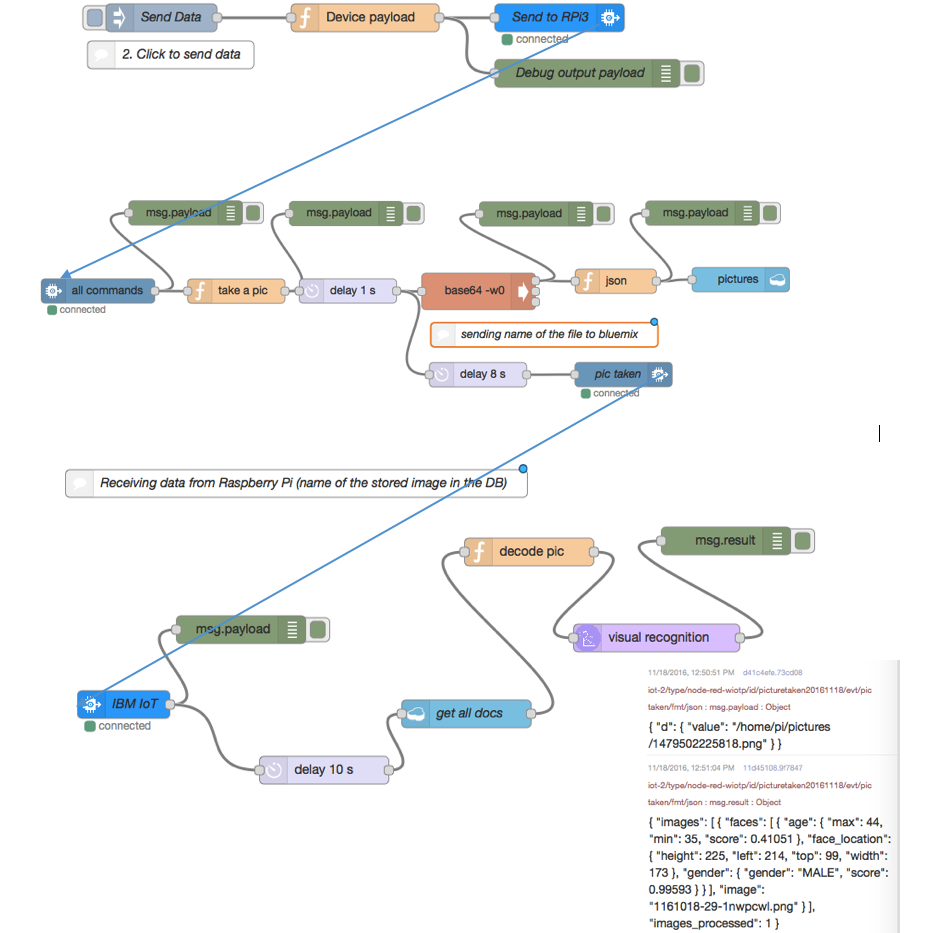

## Overview
In this lab you will expand the LAB1 functionality into 2-way communications between IBM Bluemix and a Raspberry Pi, again through the Node Red environment. 
Optionally we will add an camera (RaspCam) to Raspberry Pi to take pictures and analyze them. These pictures can then be sent to the Cloudant NoSQL Database hosted on the IBM Bluemix cloud. 
Then the images can be analyzed with the Watson Visual Analysis service.  
If a person is found in the picture we could drill down further to obtain their gender and approximate age. This information can then be sent to selected smartphones via the Twilio service.
For the communications between the Raspberry Pi and Bluemix we will use the Internet of Things Platform https://console.ng.bluemix.net/catalog/services/internet-of-things-platform

To create the application in this lab, follow these main steps:

1.	In the Watson IoT platform you would create a new device type and a new device.
2.	Using the default flow you would send a command to Raspberry Pi
3.	(optional) You would add a camera to Raspberry Pi (RaspCam)
4.	You would load an image to Cloudant NoSQL DB
5. 	You would pass the information to Bluemix on the name of the image for the Watson Visual Analysis
6.  You will create an iOS app in Swift to retrive the image from the Cloudant database
7. 	(optional) You would send a text message to your mobile phone thru Twilio API service

This is the chart describing what is the flow of the actions (Bluemix -> Raspberry Pi -> Bluemix/Watson).



After creating the flows as outlined before in steps 1-5 you are ready to write the extension to the iOS app from the LAB1.

You need to add the button and the image view widgets to your Main.storyboard. Then you can connect them to the code:

First UIImageView widget:

```swift
    @IBOutlet weak var imageFromDb: UIImageView!
    private var fetchedImage = UIImage()
```
And then the function triggered by the pressed button:
```swift
      @IBAction func showPictureButtonPressed(_ sender: Any) {
        NSLog("show picture button pressed")
        
        //connect to pictures DB
        let cloudantUrl = NSURL(string: "cloudant db connection url")
        let cloudantClient = CouchDBClient(url: cloudantUrl! as URL, username: "cloudant db connection user", password: "cloudant db connection password")
        let database = "pictures"
        
        //get picture
        let find = FindDocumentsOperation(selector: [:], databaseName: database, fields: ["value", "pic_date"], limit: 1, skip: 0, sort:  [], bookmark: nil, useIndex: nil, r: 1)
        { (response, httpInfo, error) in
            if let error = error {
                print("Encountered an error while reading a document. Error:\(error)")
            } else {
                
                //get the temp value from JSON
                do {
                    let data = try JSONSerialization.data(withJSONObject: response!, options: [])
                    
                    let parsedJson = try JSONSerialization.jsonObject(with: data, options: []) as! [String:Any]
                    if let nestedArray = parsedJson["docs"] as? NSArray {
                        
                        //getting nested temp from payload
                        let newDoc = nestedArray[0] as? [String:Any]
                        
                        // access nested dictionary values by key
                        let encodedImage = newDoc?["value"] as! String
                        let index = encodedImage.index(encodedImage.startIndex, offsetBy: 22)
                        let jpgImage = encodedImage.substring(from: index)  //data:image/png;base64,
                        let imageData = NSData(base64Encoded: jpgImage, options: [])!
                        let image = UIImage(data: imageData as Data)
                        
                        print(image?.size)
                        self.fetchedImage = image!
                    }
                    
                } catch  let error as NSError {
                    print(error)
                }
            }
        }
        cloudantClient.add(operation:find)
       
        //show the picture
        //we need to wait for the result
        DispatchQueue.main.asyncAfter(deadline: .now() + .seconds(10), execute: {
            // Put your code which should be executed with a delay here
            NSLog("Read doc: 10 sec")
            self.imageFromDb.image = self.fetchedImage as UIImage
        })   
    }
```


## Prerequisites 
You need the following software:

-	finished LAB1
-	(optional) RaspCam - the accessory camera for Raspberry Pi
- XCode v8 - IDE for iOS
-	(optional) Twilio account

## Next steps
Please follow [LAB 3](https://github.com/blumareks/iot-watson-swift/tree/master/lab3).

@blumareks, http://blumareks.blogpost.com
